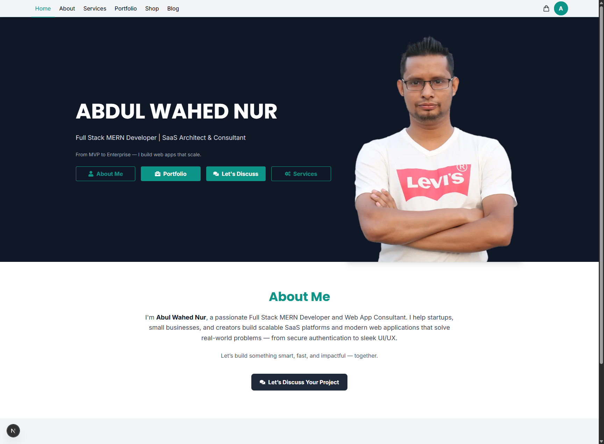

# 👨‍💻 Abul Wahed Nur — Full Stack Developer & Consultant

🎯 Full Stack MERN Developer | SaaS & Web App Strategist | Former VFX Artist  
💡 Bridging 10+ years of creative experience with modern software development.

Welcome to my personal web platform — a **mission-driven digital hub** that combines technology, tools, and expertise to help businesses and individuals scale **smarter**, **faster**, and **more securely**.

---

## 🚀 What I Do

This is not just a portfolio. It’s a platform where I:

- 🚀 Build & deliver **production-grade web solutions**
- 🧰 Sell **developer-friendly toolkits & UI kits**
- 💼 Offer **consulting services** to startups, founders & tech teams

> ✅ Built to scale.  
> 🔒 Built with security in mind.  
> ⚙️ Built for real-world use.

---

## 🧠 About Me

With over a **decade of experience in animation, motion graphics, and VFX**, I bring a uniquely creative mindset into **full-stack development**.

I now specialize in building robust **SaaS platforms**, **eCommerce systems**, and **enterprise-grade dashboards** that align with business needs and drive growth.

🔍 I help you discover:

- What features your product _actually_ needs
- How to optimize workflows and architecture
- Where hidden features improve **conversion, retention & ROI**

I don’t just write code — I **build products that scale**.

---

## 🛠️ Tech Stack & Tools

### 🖥️ Frontend

- **Next.js 15 (App Router)**
- **React 19** + Redux Toolkit
- **Tailwind CSS 4.0** (Utility-first styling)
- **TanStack Query** (React Query)
- **Axios**, **Framer Motion**, **SweetAlert2**, **Sonner**

### 🔐 Auth & Security

- **NextAuth.js (v4)** – Credentials + OAuth (Google, GitHub, Facebook)
- **JWT Authentication**
- **Firebase Auth**

### 🌐 Backend

- **Node.js + Express**
- **MongoDB (Mongoose)**
- **PostgreSQL / MySQL**
- **REST APIs**

### 💳 Payment & Integrations

- **Stripe (One-time + Subscription)**
- **SSLCommerz**
- **Cloudinary**
- **Firebase (Auth & Hosting)**

### ⚒️ Other Tools

- Git & GitHub
- Postman
- Vercel / Netlify
- VS Code
- After Effects, Premiere Pro (VFX)

---

## 📦 Projects & Case Studies

### 🧩 Featured Projects

- `Car Doctor` – Auth-based car servicing app with admin dashboard
- `Job Portal` – Role-based user system for job seekers & providers
- `Apartment Manager` – Service & rent tracking with MongoDB relations
- `Home Service Platform` – Vendor-based service system like Sheba.xyz

### 🏗️ Currently Working On

- Full-featured **Next.js SaaS portfolio website**
  - Stripe Payment Gateway
  - Booking System with Support Ticket
  - Monthly Subscription
- SaaS Dashboard UI Kits
- ERP Modules for B2B/B2C, Inventory, HRM

---

## 🎨 From VFX to Full Stack

Before becoming a full-time developer, I was a **professional VFX artist and animator**, working with:

- Branding Commercials
- Product Visuals & Motion Graphics
- 2D/3D Effects

This creative background helps me deliver **visually stunning UIs** and **user-centered design** with every project.

---

## 🔧 Quick Start (Coming Soon)

```bash
git clone https://github.com/wahednur/wahednur.git
cd your-project
npm install
npm run dev
```
