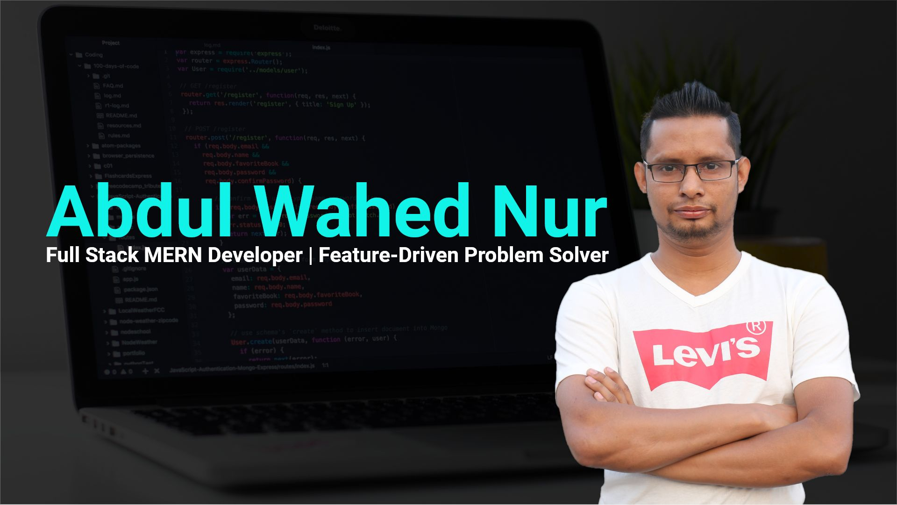

# 👋 Hi there, I'm Abdul Wahed Nur (Wahed)

🎯 Full Stack MERN Developer | SaaS & Web App Strategist | Former VFX Artist  
💡 Bridging 10+ years of creative experience with modern software development.

---

## 🧠 About Me

With over a **decade of experience in animation, motion graphics, and VFX**, I bring a unique creative mindset into the world of **full-stack web development**.  
Today, I focus on building robust **SaaS platforms**, **eCommerce solutions**, and **enterprise-level dashboards** that are not only technically sound but deeply aligned with real-world business needs.

🔍 I specialize in identifying:
- What features your business *actually* needs
- How workflows can be optimized
- Which hidden features increase **conversion, retention, and ROI**

I don't just build apps — I help build **products that scale**.

---

## 🚀 Tech Stack & Tools

**Frontend:**
- React.js (React 19)
- Next.js (learning)
- Tailwind CSS
- Axios, React Router DOM

**Backend:**
- Node.js
- Express.js
- MongoDB
- Firebase Auth
- JWT Auth

**Integrations:**
- Stripe Payments (One-time & Subscription)
- Cloudinary (Free Tier)
- Firebase (Hosting & Auth)

**Other:**
- Git & GitHub
- Postman
- Vercel / Netlify
- VS Code
- Animation Software (After Effects, Premiere Pro, etc.)

---

## 📦 Projects & Interests

### 🔧 Recent Projects:
- `Car Doctor` – Auth-based car servicing app with admin dashboard
- `Job Portal` – Role-based user system for job seekers & providers
- `Apartment Manager` – Relational DB (MongoDB) with service & rent tracking
- `Home Service Platform` – Similar to Sheba.xyz with vendor & service logic

### 📌 Currently Working On:
- Personal Portfolio Website with:
  - Service Booking & Support System
  - Stripe Payment Gateway
  - Monthly Subscription Support
- SaaS Dashboard Templates
- Building E-commerce ERP modules (B2B, B2C, Inventory, HRM)

---

## 🎨 My Background in Creative Industry

Before diving into full-time development, I was a **professional VFX artist & commercial animator**. I’ve worked on:
- Commercial Ads
- Branding Videos
- High-End Motion Graphics
- 3D/2D Visual Effects

This background gives me an edge in designing **visually impactful interfaces** and thinking **beyond code** to deliver smooth, immersive user experiences.

---

## 📫 Let's Connect

- 💼 LinkedIn: [linkedin.com/in/wahednur](https://linkedin.com/in/wahednur)
- 🖥️ Portfolio: Coming Soon...
- 📧 Email: wahednur@gmail.com
- 🌐 GitHub: [github.com/wahednur](https://github.com/wahednur)

---

> 🔄 “From visuals to logic — I turn creative ideas into working, scalable apps.”

### ✨ Let's Build Something Great Together!
